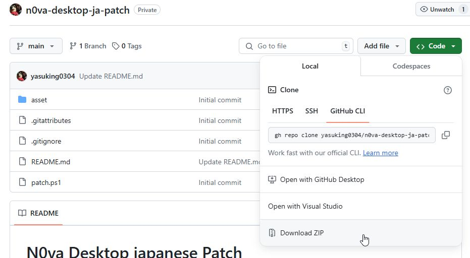
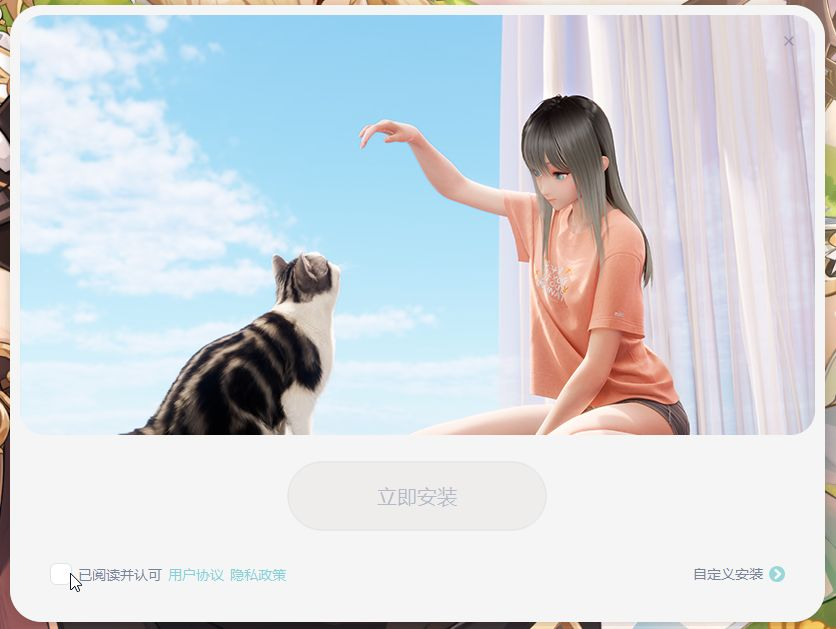
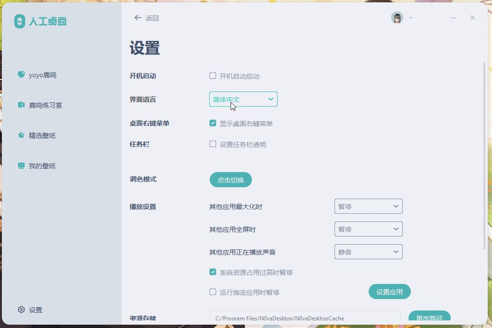
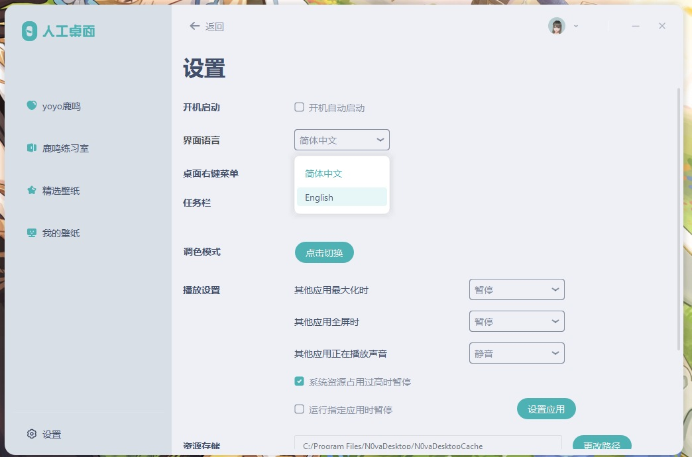
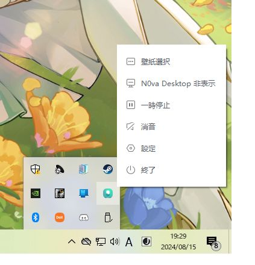

# N0va Desktop japanese Patch

This site is only available in Japanese.

<hr>

Copyright © 2021 miHoYo<br>
© COGNOSPHERE. All Rights Reserved.
<br>
<br>
N0va DesktopはmiHoYo社が提供する64bit Windows向けの人工キャラクターLumiのデスクトップアクセサリならびに、miHoYoが提供しているゲームの壁紙サービスアプリケーションです。<br>
　壁紙はフルHD(1920x1080)とWQHD(2560x1440)サイズが提供されています。**4K(3840x2160)サイズは提供されていません**。

本パッチは、N0va Desktopの**英語のリソース**の一部を日本語に置き換えるものです。このため言語設定は「English」となるのでご注意ください。<br>
　N0va Desktopの著作権はCognosphere、miHoYoにあります。本パッチは前述した会社とは関係ありません。<br>

## 非公式な実行推奨環境

公式ページでも推奨環境は書いてありますがCPUの世代が書いてなかったりGPUスペックにピンと来ないので補足。

- Windows 7以降の64bit環境(Windows10を推奨、Windows11では一部制限あり)
- 最低でも第三世代Intel Core i3以上の4コア 64bit CPU
- RAM 4GB以上(8GB以上を推奨)
- なるべく大きなストレージ(SSDを推奨)
- 最低でもGeForce GT 740 1GBRAM 程度のGPU搭載を推奨

## パッチ導入手順

* ダウンロード先はこちら<br>
  https://github.com/yasuking0304/n0va-desktop-ja-patch/

1. ブラウザを開いて上記URLにアクセスしてください。<br>
2. 画面の右上の方にある緑色の「<> Code」ボタンをクリックして、メニューの「Download ZIP」をクリックしてください。<br><br>
<br><br>
3. ダウンロードしたZIPファイルを適当な場所(例えばデスクトップ)に解凍してください。

## N0va Desktopのインストール方法

* ダウンロード先はこちら<br>
  https://n0va.mihoyo.com/#/

1. ブラウザを開いて上記URLにアクセスしてください。<br>

2. 「PC版 下载(PC版ダウンロード)」ボタンをクリックしてください。<br>
  【注意】 なお、2024年8月現在、steam版 および 英語版 https://mihoyodesktop.mihoyo.com/#/ ではダウンロード出来なくなっています。またこちらで事前にダウンロードした ``n0va-desktop-2-2-1-3.exe`` をインストールしても**2024年2月以降に提供された壁紙はリストに表示されません**。
3. もし以前の N0va Desktop をインストール済みの場合、事前にアンインストールしておいてください。<br>
  【注意】 アンインストールしなくても正常にインストールは可能ですが、以前の壁紙は引き継がれないうえにプレイリストは削除されず、いろいろ面倒なことになります。<br>
  壁紙はあらためて新規にダウンロードすることになりますが一部前回に収納されていたものがダウンロード不可になっている壁紙が存在します（例えば原神では水仙十字結社の	
ルネ・ド・ペトリコール）。
4. ダウンロードした ``N0vaDesktop_2.2.1.3_mihoyo.exe``を実行してください。<br>
　上記インストーラーとの違いはデジタル証明書が付加されているためWindowsによるダウンロード確認ダイアログは表示されず、安心してインストール処理が行えます。<br>
  **なお、このインストーラーは簡体中国語表示です**<br>
  <br>
5. 権限昇格に同意し、インストーラーが起動したら「已阅读并认可 用户协议 隐私政策(ユーザー契約のプライバシーポリシーを読み、承認します)」にチェックします。<br>
  <br>

6. 「立即安装(今すぐインストール)」ボタンが活性化しますのでクリックして先に進めます。あとは指示に従ってください。

7. 簡体中国語版のため、初期表示は「簡体中文」になっています。このため、デスクトップ画面の何もないところでマウスの右クリックし、メニューから「壁紙選択」してください。<br>
8. 画面が開いたら画面左下の「设置」をクリックして言語設定を「English」に切り替えてください。<br>再起動要求されますので「Restart」ボタンをクリックしてください。<br>
  <br>
  <br>


## 日本語パッチの実行

英語のリソースを日本語に置き換え、「人工桌面」リンクアイコンがデスクトップに存在していれば「N0va Desktop」に名前を変更します。
1. コマンドプロンプトまたはPowerShellを開きます。
2. パッチ導入手順で解凍したディレクトリに移動します。
    ```
    cd <パッチ導入手順で解凍したディレクトリ>
    ```
3. 下記コマンドを実行してください。
    ```
    powershell -NoProfile -ExecutionPolicy Unrestricted .\patch.ps1
    ```
4. 画面に従って操作してください。

**なお、Visual Code Studio、node.jsおよびnpmの環境が整っている場合、Visual Code Studio の NPMスクリプトから「patch」を選択して実行しても同様の処理が行えます。**


## 【参考】N0va Desktopの終了方法

Windowsのタスクトレイを展開し、「N0va Desktop」アイコン上でマウスの右クリックで表示されるメニューから「終了」 (リソースが英語のままであれば「Exit」 )を選択してください。簡体中文であれば「人工桌面」アイコン上でマウスの右クリックで表示されるメニューから「退出」を選択してください。

  <br>


## 翻訳ファイルの作成に使用したツール

翻訳ファイルの作成に Linguist を使用しています。翻訳ファイルの修正を行いたい場合は以下のように行ってください。

* ダウンロード先はこちら<br>
  https://github.com/thurask/Qt-Linguist

1. ブラウザを開いて上記URLにアクセスしてください
2. GitHubのページの 右側の Release 欄から Latestをクリックして、 最新の linguist_6.7.x.zip をダウンロードしてください。

3. zipファイルを解凍してください。

4. linguist.exe を実行してください。

5. メニュー「File」から「Open」を選択してください。

6. ファイルタイプを「All files(*)」に変更し、``<このリポジトリの解凍先>\asset\language\ja-jp.qm`` を選択してください。

## 問題点
- 本パッチは、英語のリソースを強制的に日本語に置き換えるだけでフォントセット情報は変えていないため、表記欠け、日本語フォントのジャギーが発生します。
- 結構な箇所で翻訳されていない項目がありますが、そのほとんどが翻訳不可能です。
